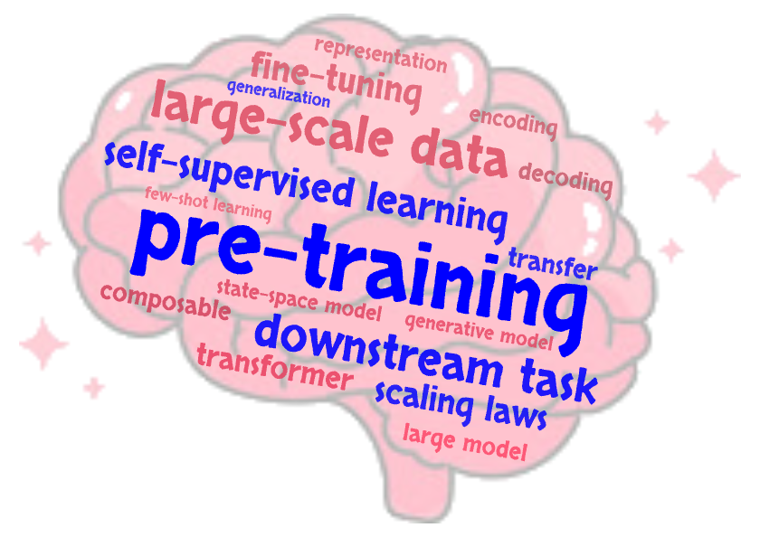

# Awesome Foundation Models for the Brain

A professionally curated list of **Modeling papers**, **Datasets**, **Experimental papers**, **Code Repositories**, and **Benchmarks** for ***Foundation Model for the Brain***. This repository compiles 
- recent works in <mark>pre-trained foundation models</mark> in neuroscience (_with available code_)
- <mark>classical machine learning and statistical models</mark> of neural data, with sorted subject, recording method, and behavioral task (_with available code_)
- <mark>large-scale experimental recording and/or imaging</mark> of neural activity, especially with neuropixel and widefield imaging (_with available data and code_)
- perspectives and reviews on large-scale neural data analysis
- benchmarks, python libraries, and opensource data platform for neural and behavior data
- tutorials and other resources for foundation models for the brain

though it may not be fully exhaustive. This repository is a work in progress and will be updated regularly.

> If you have any suggestions or want to contribute, feel free to reach out or open an issue!

## Table of Contents
- [Awesome-Foundation-Models-for-the-Brain](#awesome-foundation-models-for-the-brain)
  - [Table of Contents](#table-of-contents)
  - [Keywords Convention](#keywords-convention)
  - [Papers with pretrained models](#papers-with-pretrained-models-total-12)
  - [Datasets and Tools](#datasets-and-tools)
  - [Other related papers](#other-related-papers-total-185-highlighted-total-28)
    - [Machine learning and statistical models](#machine-learning-and-statistical-models-total-73-highlighted-total-11)
      - [Electrophysiology analysis](#electrophysiology-analysis-total-40-highlighted-total-6)
      - [Optical physiology analysis](#optical-physiology-analysis-total-19-highlighted-total-5)
      - [iEEG (intracranial electroencepholography) analysis](#ieeg-intracranial-electroencepholography-analysis-total-2)
      - [EEG (electroencepholography) and fMRI analysis](#eeg-electroencepholography-and-fmri-analysis-total-12)
    - [Large-scale experimental recording and imaging](#large-scale-experimental-recording-and-imaging-total-85-highlighted-total-12)
      - [Electrophysiology recording](#electrophysiology-recording-total-25-highlighted-total-7)
      - [Optical imaging](#optical-imaging-total-28-highlighted-total-5)
      - [Connectome and transcriptome](#connectome-and-transcriptome-total-32)
    - [Perspective and review](#perspective-and-review-total-27-highlighted-total-5)
  - [Benchmarks](#benchmarks)
  - [Other resources](#other-resources)
  - [Open Challenges](#Open-Challenges)
  - [Acknowledgements](#acknowledgements)

### Keywords Convention

subject:
 Data from human.
 Data from non-human primates.
 Data from rat.
 Data from mouse.
 Data from zebrafish.
 Data from Drosophila.

recording method:
 Electrophysiology recording.
 Calcium imaging.
 fMRI imaging.
 EEG (electroencepholography) recording.
 EEG (intracranial EEG) recording, including ECoG (electrocorticography) and sEEG (stereo-electroencephalography).

Task:
 Visual task or passively looking.
 Auditory task.
 Speech processing.
 Somatosensory task, such as shape discrimination with whiskering.
  Olfactory task.
 Motor task, such as reaching.
 Decision making task, such as 2AFC or context-dependent 2AFC.
 Working memory task, such as timing interval reproduction task.
 Spatial navigation task.
 Social behavior.
 Recordings when subject is sleeping.
 Analysis and/or recordings related to bio-marker detection in disease or disease diagnosis.

<!-- Highlights:
 Data from at least 3 brain areas, or from both cortical and subcortical areas. -->

## Papers with pretrained models (Total: 12)
- POYO+: Multi-session, multi-task neural decoding from distinct cell-types and brain regions [[ICLR 2025 spotlight](https://openreview.net/forum?id=IuU0wcO0mo)]   
- Foundation model of neural activity predicts response to new stimulus types and anatomy [[Nature 2025](https://www.nature.com/articles/s41586-025-08829-y)] [[GitHub](https://github.com/cajal/foundation)] [[data](https://bossdb.org/project/microns-minnie)]   
- NEDS: Neural Encoding and Decoding at Scale [[arXiv 2025](https://arxiv.org/abs/2504.08201)]   
- NDT3: A Generalist Intracortical Motor Decoder [[bioRxiv 2025](https://www.biorxiv.org/content/10.1101/2025.02.02.634313v1.abstract)] [[GitHub](https://github.com/joel99/ndt3)] [[model weights](https://huggingface.co/joel99/ndt3)]    
- Towards a "Universal Translator" for Neural Dynamics at Single-Cell, Single-Spike Resolution [[NeurIPS 2024](https://proceedings.neurips.cc/paper_files/paper/2024/hash/934eb45b99eff8f16b5cb8e4d3cb5641-Abstract-Conference.html)] [[GitHub](https://github.com/colehurwitz/IBL_MtM_model)] [[data](https://int-brain-lab.github.io/iblenv/notebooks_external/data_release_brainwidemap.html)] [[website](https://ibl-mtm.github.io)] [[model weights](https://huggingface.co/ibl-foundation-model)]   
- BrainLM: A foundation model for brain activity recordings [[ICLR 2024](https://openreview.net/forum?id=RwI7ZEfR27)] [[GitHub](https://github.com/vandijklab/BrainLM)] [[data](https://www.fmrib.ox.ac.uk/ukbiobank/fbp/)] [[model weights](https://huggingface.co/vandijklab/brainlm)]   
- Multi-X DDM: One Model to Train Them All: A Unified Diffusion Framework for Multi-Context Neural Population Forecasting [[arXiv 2024](https://openreview.net/forum?id=R9feGbYRG7)]  
- Brant: Foundation model for intracranial neural signal [[NeurIPS 2023](https://openreview.net/forum?id=DDkl9vaJyE)] [[GitHub](https://github.com/yzz673/Brant)] [[website](https://zju-brainnet.github.io/Brant.github.io/)] [[model weights](https://drive.google.com/file/d/1QzxTNBvgcJBRxa8W2mNq2Tj967GtlDLF/view)]  
- Neural Data Transformer 2: Multi-context Pretraining for Neural Spiking Activity [[NeurIPS 2023](https://proceedings.neurips.cc/paper_files/paper/2023/hash/fe51de4e7baf52e743b679e3bdba7905-Abstract-Conference.html)] [[GitHub](https://github.com/joel99/context_general_bci)]    
- POYO-1: A Unified, Scalable Framework for Neural Population Decoding [[NeurIPS 2023](https://arxiv.org/abs/2310.16046)] [[GitHub](https://github.com/neuro-galaxy/poyo)] [[data](https://brainsets.readthedocs.io/en/latest/glossary/brainsets.html#perich-miller-population-2018)] [[website](https://poyo-brain.github.io)] [[model weights](https://torch-brain.s3.amazonaws.com/model-zoo/poyo_mp.ckpt)]   
- BrainBERT: Self-supervised representation learning for intracranial recordings [[ICLR 2023](https://openreview.net/forum?id=xmcYx_reUn6)] [[GitHub](https://github.com/czlwang/BrainBERT)] [[model weights](https://drive.google.com/file/d/14ZBOafR7RJ4A6TsurOXjFVMXiVH6Kd_Q/view?usp=sharing)]  
- CEBRA: Learnable latent embeddings for joint behavioural and neural analysis [[Nature 2023](https://www.nature.com/articles/s41586-023-06031-6)] [[GitHub](https://github.com/AdaptiveMotorControlLab/cebra)] [[website](https://cebra.ai)]      

## Datasets and Tools

- DANDI Archive: an archive for publishing and sharing neurophysiology data including electrophysiology, optophysiology, and behavioral time-series, and images from immunostaining experiments. [[website](https://dandiarchive.org)]
- data from International Brain Laboratory [[website](https://www.internationalbrainlab.com/data)]
- data from janelia research campus [[website](https://www.janelia.org/open-science/search?sort_by=field_date&items_per_page=10&redirect=1&f[0]=field_tool_term_reference%3A5584)]
- <mark>temporaldata: a Python package that provides advanced data structures and methods to work with multi-modal, multi-resolution time series data</mark> [[GitHub](https://github.com/neuro-galaxy/temporaldata)] [[installation](https://temporaldata.readthedocs.io/en/latest/concepts/installation.html)] [[tutorial](https://temporaldata.readthedocs.io/en/latest/concepts/creating_objects.html)] [[documentation](https://temporaldata.readthedocs.io/en/latest/package.html)]
- <mark>brainsets: a Python package for processing neural data into a standardized format</mark> [[GitHub](https://github.com/neuro-galaxy/brainsets)] [[installation](https://brainsets.readthedocs.io/en/latest/concepts/installation.html)] [[tutorial](https://brainsets.readthedocs.io/en/latest/concepts/using_existing_data.html)] [[documentation](https://brainsets.readthedocs.io/en/latest/package/core.html#)]
- NeMoS: a statistical modeling framework optimized for systems neuroscience in Python, currently focusing on the Generalized Linear Model (GLM). [[GitHub](https://github.com/flatironinstitute/nemos)] [[installation](https://nemos.readthedocs.io/en/latest/installation.html)] [[tutorial](https://nemos.readthedocs.io/en/latest/tutorials/README.html)] [[documentation](https://nemos.readthedocs.io/en/latest/api_reference.html)]
- <mark>CaImAn: a Python toolbox for large-scale calcium imaging data analysis</mark> [[GitHub](https://github.com/flatironinstitute/CaImAn)] [[installation](https://github.com/flatironinstitute/CaImAn/blob/main/docs/source/Installation.rst)] [[tutorial](https://github.com/flatironinstitute/CaImAn/blob/main/demos/notebooks/demo_pipeline.ipynb)] [[documentation](https://caiman.readthedocs.io/en/latest/)] [[talk](https://www.youtube.com/watch?v=rUwIqU6gVvw)]
- pynapple: a light-weight Python library for neurophysiological data analysis [[GitHub](https://github.com/pynapple-org/pynapple)] [[installation](https://pynapple.org/installing.html)] [[tutorial](https://pynapple.org/user_guide/01_introduction_to_pynapple.html)] [[documentation](https://pynapple.org/index.html)]
- <mark>torch_brain: a Python library for various deep learning models designed for neuroscience</mark> [[GitHub](https://github.com/neuro-galaxy/torch_brain)] [[installation](https://torch-brain.readthedocs.io/en/latest/concepts/installation.html)] [[documentation](https://torch-brain.readthedocs.io/en/latest/package/data/index.html)]
- plenoptic: a Python library for model-based synthesis of perceptual stimuli [[GitHub](https://github.com/plenoptic-org/plenoptic)] [[installation](https://docs.plenoptic.org/docs/branch/main/install.html)] [[tutorial](https://workshops.plenoptic.org/workshops/CSHL-vision-course-2024/branch/main/)] [[documentation](https://docs.plenoptic.org/docs/branch/main/)] [[talk](https://presentations.plenoptic.org)]
- neurosift: a browser-based tool designed for the visualization of neuroscience data with a focus on NWB (Neurodata Without Borders) files, and enables interactive exploration of the DANDI Archive and OpenNeuro online repositories [[GitHub](https://github.com/flatironinstitute/neurosift?tab=readme-ov-file)] [[example](https://nbfiddle.app/?url=https://gist.github.com/magland/dcddee65b7549fbf0b5e142c07ffbed0%23file-neurosift-examples-ipynb)]
- lfads-torch: A modular and extensible implementation of latent factor analysis via dynamical systems [[GitHub](https://github.com/arsedler9/lfads-torch)]
- <mark>DeepLabCut: a software package for animal pose estimation</mark> [[GitHub](https://github.com/DeepLabCut/DeepLabCut)] [[installation](https://deeplabcut.github.io/DeepLabCut/docs/installation.html)] [[tutorial](https://deeplabcut.github.io/DeepLabCut/docs/beginner-guides/Training-Evaluation.html)] [[documentation](https://deeplabcut.github.io/DeepLabCut/docs/standardDeepLabCut_UserGuide.html)]
- SLEAP: Social LEAP Estimates Animal Poses [[website](https://sleap.ai)] [[installation](https://sleap.ai/installation.html)] [[tutorial](https://sleap.ai/tutorials/tutorial.html)] [[example](https://sleap.ai/notebooks/index.html)] [[documentation](https://sleap.ai/api.html)]
- B-SOiD: An Open Source Unsupervised Algorithm for Discovery of Spontaneous Behaviors [[GitHub](https://github.com/YttriLab/B-SOID)] 
- Keypoint-MoSeq: parsing behavior by linking point tracking to pose dynamics [[website](https://dattalab.github.io/moseq2-website/index.html)] [[installation](https://keypoint-moseq.readthedocs.io/en/latest/install.html)] [[tutorial](https://dattalab.github.io/moseq2-website/index.html#tutorials)] [[documentation](https://keypoint-moseq.readthedocs.io/en/latest/)]
- OpenPose: real-time multi-person system to jointly detect human body, hand, facial, and foot keypoints on single images [[GitHub](https://github.com/CMU-Perceptual-Computing-Lab/openpose)] [[installation](https://github.com/CMU-Perceptual-Computing-Lab/openpose?tab=readme-ov-file#installation)] [[tutorial](https://github.com/CMU-Perceptual-Computing-Lab/openpose/tree/master/examples/tutorial_api_python)] [[documentation](https://github.com/CMU-Perceptual-Computing-Lab/openpose/blob/master/doc/03_python_api.md)]
- fastplotlib: an expressive plotting library in Python that enables rapid prototyping for large scale exploratory scientific visualization [[GitHub](https://github.com/fastplotlib/fastplotlib)] [[installation](https://fastplotlib.org/ver/dev/user_guide/guide.html)] [[tutorial](https://github.com/fastplotlib/fastplotlib/blob/main/examples/notebooks/quickstart.ipynb)] [[documentation](https://www.fastplotlib.org/ver/dev/)]
- <mark>Brain-Score: integrative benchmarks and models at scale aiming to yield accurate, machine-executable computational models of how the brain gives rise to the mind</mark> [[website](https://www.brain-score.org)]
- OpenNeuro: A free and open platform for validating and sharing BIDS-compliant MRI, PET, MEG, EEG, and iEEG data [[website](https://openneuro.org)]

## Other related papers (Total: 185, Highlighted total: 28)

### Machine learning and statistical models (Total: 73, Highlighted total: 11)

#### Electrophysiology analysis (Total: 40, Highlighted total: 6)

- <mark>Meta-Dynamical State Space Models for Integrative Neural Data Analysis</mark> [[ICLR 2025 spotlight](https://openreview.net/forum?id=SRpq5OBpED)]   
- In vivo cell-type and brain region classification via multimodal contrastive learning [[ICLR 2025 spotlight](https://openreview.net/forum?id=10JOlFIPjt)] [[website](https://ibl-nemo.github.io)]    
- Individual variability of neural computations underlying flexible decisions [[Nature 2024](https://www.nature.com/articles/s41586-024-08433-6)] [[GitHub](https://github.com/Brody-Lab/flexible_decision_making_training)] [[data](https://github.com/Brody-Lab/flexible_decision_making_rats)]   
- <mark>A nonoscillatory, millisecond-scale embedding of brain state provides insight into behavior</mark> [[Nature Neuroscience 2024](https://www.nature.com/articles/s41593-024-01715-2)] [[GitHub](https://github.com/hengenlab)] [[data](https://atlas.brain-map.org)]   
- LDNS: Latent Diffusion for Neural Spiking Data [[NeurIPS 2024 spotlight](https://arxiv.org/abs/2407.08751)] [[GitHub](https://github.com/mackelab/LDNS)]     
- eXponential FAmily Dynamical Systems (XFADS): Large-scale nonlinear Gaussian state-space modeling [[NeurIPS 2024](https://openreview.net/forum?id=Ln8ogihZ2S&noteId=UOrlEs2TjB)] [[GitHub](https://github.com/catniplab/xfads)]    
- gpSLDS: Modeling Latent Neural Dynamics with Gaussian Process Switching Linear Dynamical Systems [[NeurIPS 2024](https://openreview.net/forum?id=LX1lwP90kt&referrer=%5Bthe%20profile%20of%20Amber%20Hu%5D(%2Fprofile%3Fid%3D~Amber_Hu1))] [[GitHub](https://github.com/lindermanlab/gpslds)]   
- Most discriminative stimuli for functional cell type clustering [[ICLR 2024](https://arxiv.org/abs/2401.05342v2#)] [[GitHub](https://github.com/ecker-lab/most-discriminative-stimuli)]    
- One-hot Generalized Linear Model for Switching Brain State Discovery [[ICLR 2024](https://openreview.net/forum?id=MREQ0k6qvD)] [[GitHub](https://github.com/JerrySoybean/onehot-hmmglm)]      
- <mark>Leveraging Generative Models for Unsupervised Alignment of Neural Time Series Data</mark> [[ICLR 2024](https://openreview.net/forum?id=9zhHVyLY4K)]   
- A conserved code for anatomy: Neurons throughout the brain embed robust signatures of their anatomical location into spike trains [[eLife 2024](https://elifesciences.org/reviewed-preprints/101506)]   
- Nonlinear manifolds underlie neural population activity during behaviour [[bioRxiv 2024](https://www.biorxiv.org/content/10.1101/2023.07.18.549575v3)]     
- A mosaic of whole-body representations in human motor cortex [[bioRxiv 2024](https://www.biorxiv.org/content/10.1101/2024.09.14.613041v1.abstract)] [[GitHub](https://github.com/cffan/neural_seq_decoder)]   
- GNOCCHI: Diffusion-Based Generation of Neural Activity from Disentangled Latent Codes [[arXiv 2024](https://arxiv.org/abs/2407.21195)]   
- <mark>Preserved neural dynamics across animals performing similar behaviour</mark> [[Nature 2023](https://www.nature.com/articles/s41586-023-06714-0)] [[GitHub](https://github.com/BeNeuroLab/2022-preserved-dynamics)] [[data](https://crcns.org/data-sets/motor-cortex/pmd-1)]    
- The centrality of population-level factors to network computation is demonstrated by a versatile approach for training spiking networks [[Neuron 2023](https://www.cell.com/neuron/fulltext/S0896-6273(22)01080-7)] [[GitHub](https://github.com/briandepasquale/factor-based-spiking-nets/)] [[data](https://zenodo.org/records/7302474)]    
- Associations between in vitro, in vivo and in silico cell classes in mouse primary visual cortex [[Nature Communications 2023](https://www.nature.com/articles/s41467-023-37844-8)]   
- <mark>Extraction and Recovery of Spatio-Temporal Structure in Latent Dynamics Alignment with Diffusion Models</mark> [[NeurIPS 2023 spotlight](https://proceedings.neurips.cc/paper_files/paper/2023/hash/7abbcb05a5d55157ede410bb718e32d7-Abstract-Conference.html)] [[GitHub](https://github.com/yulewang97/ERDiff)]   
- Taking the neural sampling code very seriously: A data-driven approach for evaluating generative models of the visual system [[NeurIPS 2023](https://proceedings.neurips.cc/paper_files/paper/2023/hash/458d9f2dd5c7565af60143630dc62f10-Abstract-Conference.html)] [[GitHub](https://github.com/sinzlab/neural-sampling-neurips2023)]   
- Linear Time GPs for Inferring Latent Trajectories from Neural Spike Trains [[ICML 2023](https://arxiv.org/abs/2306.01802)]   
- Real-time variational method for learning neural trajectory and its dynamics [[ICLR 2023](https://openreview.net/forum?id=M_MvkWgQSt)]   
- Detecting change points in neural population activity with contrastive metric learning [[NER 2023](https://ieeexplore.ieee.org/abstract/document/10123821)] [[GitHub](https://github.com/npuchkin/contrastive_change_point_detection)]   
- Using adversarial networks to extend brain computer interface decoding accuracy over time [[eLife 2023](https://elifesciences.org/articles/84296#content)]   
- ODIN: Expressive dynamics models with nonlinear injective readouts enable reliable recovery of latent features from neural activity [[arXiv 2023](https://arxiv.org/abs/2309.06402v1)]   
- <mark>AutoLFADS: A large-scale neural network training framework for generalized estimation of single-trial population dynamics</mark> [[Nature Methods 2022](https://www.nature.com/articles/s41592-022-01675-0)] [[GitHub](https://snel-repo.github.io/autolfads/)] [[data](https://dandiarchive.org/dandiset/000070)]   
- Seeing the forest and the tree: Building representations of both individual and collective dynamics with transformers [[NeurIPS 2022](https://openreview.net/forum?id=5aZ8umizItU)] [[GitHub](https://github.com/nerdslab/EIT)] [[website](https://nerdslab.github.io/EIT/)]   
- Stabilizing brain-computer interfaces through alignment of latent dynamics [[bioRxiv 2022](https://www.biorxiv.org/content/10.1101/2022.04.06.487388v2)]   
- NDT1: Representation learning for neural population activity with Neural Data Transformers [[Neurons, Behavior, Data analysis, and Theory 2021](https://arxiv.org/abs/2108.01210)] [[GitHub](https://github.com/snel-repo/neural-data-transformers)]   
- SwapVAE: Drop, Swap, and Generate: A Self-Supervised Approach for Generating Neural Activity [[NeurIPS 2021 oral](https://openreview.net/forum?id=ZRPRjfAF3yd)] [[GitHub](https://github.com/nerdslab/SwapVAE)] [[website](https://nerdslab.github.io/SwapVAE/)]   
- Across-animal odor decoding by probabilistic manifold alignment [[NeurIPS 2021 spotlight](https://openreview.net/forum?id=85BzB3WP-qj)] [[GitHub](https://github.com/pedroherrerovidal/amLDS)]    
- Towards robust vision by multi-task learning on monkey visual cortex [[NeurIPS 2021](https://proceedings.neurips.cc/paper/2021/hash/06a9d51e04213572ef0720dd27a84792-Abstract.html)] [[GitHub](https://github.com/sinzlab/neural_cotraining)]   
- Reverse engineering recurrent neural networks with Jacobian switching linear dynamical systems [[NeurIPS 2021](https://openreview.net/forum?id=od-00q5T2vB)] [[GitHub](https://github.com/jimmysmith1919/JSLDS_public)]   
- Long-term stability of cortical population dynamics underlying consistent behavior [[Nature Neuroscience 2020](https://www.nature.com/articles/s41593-019-0555-4)]   
- pi-VAE: Learning identifiable and interpretable latent models of high-dimensional neural activity using pi-VAE [[NeurIPS 2020](https://proceedings.neurips.cc/paper/2020/hash/510f2318f324cf07fce24c3a4b89c771-Abstract.html)] [[GitHub](https://github.com/zhd96/pi-vae)]     
- Rescuing neural spike train models from bad MLE [[NeurIPS 2020](https://arxiv.org/abs/2010.12362)] [[GitHub](https://github.com/diegoarri91/mmd-glm)]    
- Enabling hyperparameter optimization in sequential autoencoders for spiking neural data [[NeurIPS 2019](https://arxiv.org/abs/1908.07896)] [[GitHub](https://github.com/snel-repo/lfads-cd/tree/master)] [[data](https://zenodo.org/records/583331)]   
- Tree-Structured Recurrent Switching Linear Dynamical Systems for Multi-Scale Modeling [[ICLR 2019](https://arxiv.org/abs/1811.12386)] [[GitHub](https://github.com/catniplab/tree_structured_rslds)]   
- LFADS: Inferring single-trial neural population dynamics using sequential auto-encoders [[Nature Methods 2018](https://www.nature.com/articles/s41592-018-0109-9)] [[GitHub](https://github.com/tensorflow/models/tree/master/research/lfads)] [[Matlab codes](https://lfads.github.io/lfads-run-manager/)]    
- Cortical population activity within a preserved neural manifold underlies multiple motor behaviors [[Nature Communications 2018](https://www.nature.com/articles/s41467-018-06560-z)]   
- A neural network that finds a naturalistic solution for the production of muscle activity [[Nature Neuroscience 2015](https://www.nature.com/articles/nn.4042)]   

#### Optical physiology analysis (Total: 19, Highlighted total: 5)

- <mark>Mapping model units to visual neurons reveals population code for social behaviour</mark> [[Nature 2024](https://www.nature.com/articles/s41586-024-07451-8)] [[GitHub](https://github.com/murthylab/one2one-mapping)] [[data](https://dandiarchive.org/dandiset/000951/)]    
- Rastermap: a discovery method for neural population recordings [[Nature Neuroscience 2024](https://www.nature.com/articles/s41593-024-01783-4)] [[GitHub](https://github.com/mouseland/rastermap)] 
- Exploring Behavior-Relevant and Disentangled Neural Dynamics with Generative Diffusion Models [[NeurIPS 2024](https://proceedings.neurips.cc/paper_files/paper/2024/hash/3d55170799265c03b37993e02b71b2cc-Abstract-Conference.html)] [[GitHub](https://github.com/BRAINML-GT/BeNeDiff)]    
- <mark>Neuroformer: Multimodal and Multitask Generative Pretraining for Brain Data</mark> [[ICLR 2024](https://openreview.net/forum?id=W8S8SxS9Ng)] [[GitHub](https://github.com/a-antoniades/Neuroformer)] [[website](https://a-antoniades.github.io/Neuroformer_web/)]    
- Pattern completion and disruption characterize contextual modulation in the visual cortex [[bioRxiv 2024](https://www.biorxiv.org/content/10.1101/2023.03.13.532473v2.full.pdf)]    
- Facemap: a framework for modeling neural activity based on orofacial tracking [[Nature Neuroscience 2023](https://www.nature.com/articles/s41593-023-01490-6)] [[GitHub](https://github.com/mouseland/facemap)] [[data](https://janelia.figshare.com/articles/dataset/Facemap_a_framework_for_modeling_neural_activity_based_on_orofacial_tracking/23712957)]    
- Transcriptomic cell type structures in vivo neuronal activity across multiple timescales [[Cell Reports 2023](https://www.cell.com/cell-reports/fulltext/S2211-1247(23)00329-7)] [[GitHub](https://github.com/nerdslab/lolcat/tree/v0.0.1)]     
- Bipartite invariance in mouse primary visual cortex [[bioRxiv 2023](https://www.biorxiv.org/content/10.1101/2023.03.15.532836v1)]    
- The feature landscape of visual cortex [[bioRxiv 2023](https://www.biorxiv.org/content/10.1101/2023.11.03.565500v1.abstract)]    
- <mark>RADICaL: A deep learning framework for inference of single-trial neural population dynamics from calcium imaging with subframe temporal resolution</mark> [[Nature Neuroscience 2022](https://www.nature.com/articles/s41593-022-01189-0)] [[GitHub](https://github.com/snel-repo/lfads-cd/tree/radical)]   
- It takes neurons to understand neurons: Digital twins of visual cortex synthesize neural metamers [[bioRxiv 2022](https://www.biorxiv.org/content/10.1101/2022.12.09.519708v1.abstract)]    
- A flow-based latent state generative model of neural population responses to natural images [[NeurIPS 2021](https://proceedings.neurips.cc/paper_files/paper/2021/hash/84a529a92de322be42dd3365afd54f91-Abstract.html)] [[GitHub](https://github.com/sinzlab/bashiri-et-al-2021)]    
- SBTT: Deep inference of latent dynamics with spatio-temporal super-resolution using selective backpropagation through time [[NeurIPS 2021](https://openreview.net/forum?id=9pt6F8w1Jgs)] [[GitHub](https://github.com/snel-repo/sbtt-demo)]      
- <mark>Generalization in data-driven models of primary visual cortex</mark> [[ICLR 2021 spotlight](https://openreview.net/forum?id=Tp7kI90Htd)] [[GitHub](https://github.com/sinzlab/Lurz_2020_code)]    
- VaLPACa: Parallel inference of hierarchical latent dynamics in two-photon calcium imaging of neuronal populations [[bioRxiv 2021](https://www.biorxiv.org/content/10.1101/2021.03.05.434105v1.abstract)] [[GitHub](https://github.com/linclab/valpaca)]    
- On 1/n neural representation and robustness [[NeurIPS 2020](https://arxiv.org/abs/2012.04729)] [[GitHub](https://github.com/josuenassar/power_law)]    
- <mark>Localized semi-nonnegative matrix factorization (LocaNMF) of widefield calcium imaging data</mark> [[PLOS Computational Biology 2020](https://journals.plos.org/ploscompbiol/article?id=10.1371/journal.pcbi.1007791)] [[GitHub](https://github.com/ikinsella/locaNMF)]  
- Stimulus domain transfer in recurrent models for large scale cortical population prediction on video [[NeurIPS 2018](https://proceedings.neurips.cc/paper/2018/hash/9d684c589d67031a627ad33d59db65e5-Abstract.html)] [[GitHub](https://github.com/sinzlab/Sinz2018_NIPS)]    
- Learning a latent manifold of odor representations from neural responses in piriform cortex [[NeurIPS 2018](https://proceedings.neurips.cc/paper/2018/hash/17b3c7061788dbe82de5abe9f6fe22b3-Abstract.html)] [[GitHub](https://github.com/waq1129/olfactory)]    

#### iEEG (intracranial electroencepholography) analysis (Total: 2)

- PopT: Population Transformer: Learning Population-level Representations of Neural Activity [[ICLR 2025 oral](https://openreview.net/forum?id=FVuqJt3c4L)] [[GitHub](https://github.com/czlwang/PopulationTransformer)] [[website](https://glchau.github.io/population-transformer/)]    
- BrainNet: Epileptic Wave Detection from SEEG with Hierarchical Graph Diffusion Learning [[SIGKDD 2022](https://arxiv.org/abs/2306.13101)]    

#### EEG (electroencepholography) and fMRI analysis (Total: 12)

- SIM: Surface-based fMRI Analysis for Inter-Subject Multimodal Decoding from Movie-Watching Experiments [[arXiv 2025](https://arxiv.org/abs/2501.16471)] [[ICLR 2025](https://openreview.net/forum?id=OJsMGsO6yn)] [[GitHub](https://github.com/SD3004/sim)]     
- Brainwide hemodynamics predict neural rhythms across sleep and wakefulness in humans [[bioRxiv 2024](https://www.biorxiv.org/content/10.1101/2024.01.29.577429v3)]    
- JGAT: a joint spatio-temporal graph attention model for brain decoding [[arXiv 2023](https://arxiv.org/abs/2306.05286)] [[GitHub](https://github.com/BRAINML-GT/JGAT)]      
- LGGNet: Learning from Local-Global-Graph Representations for Brain-Computer Interface [[IEEE Transactions on NNLS 2023](https://arxiv.org/abs/2105.02786)] [[GitHub](https://github.com/yi-ding-cs/LGG)]    
- Seeing Beyond the Brain: Conditional Diffusion Model with Sparse Masked Modeling for Vision Decoding [[CVPR 2023](https://arxiv.org/abs/2211.06956)]    
- Unsupervised Multivariate Time-Series Transformers for Seizure Identification on EEG [[ICMLA 2022](https://arxiv.org/abs/2301.03470)] [[GitHub](https://github.com/ilkyyldz95/EEG_MVTS)]    
- Brain kernel: A new spatial covariance function for fMRI data [[NeuroImage 2021](https://www.sciencedirect.com/science/article/pii/S1053811921008533)] [[GitHub](https://github.com/waq1129/brainkernel)]      
- Uncovering the structure of clinical EEG signals with self-supervised learning [[J Neural Engineering 2021](https://iopscience.iop.org/article/10.1088/1741-2552/abca18)] [[GitHub](https://github.com/zacharycbrown/ssl_baselines_for_biosignal_feature_extraction)]    
- Mutual information-driven subject-invariant and class-relevant deep representation learning in bci. [[IEEE Transactions on NNLS 2021](https://ieeexplore.ieee.org/document/9508768)] [[GitHub](https://github.com/eunjin93/SICR_BCI)]    
- Different scaling of linear models and deep learning in UKBiobank brain images versus machine-learning datasets [[Nature Communications 2020](https://www.nature.com/articles/s41467-020-18037-z)] [[GitHub](https://github.com/maschulz/deeperbrain)] [[data](https://www.ukbiobank.ac.uk/enable-your-research/register)]  
- Incorporating structured assumptions with probabilistic graphical models in fMRI data analysis [[Neuropsychologia 2020](https://www.sciencedirect.com/science/article/pii/S0028393220301706)]  
- EEG-GCNN: Augmenting Electroencephalogram-based Neurological Disease Diagnosis using a Domain-guided Graph Convolutional Neural Network [[NeurIPS 2020 ML4H workshop](https://arxiv.org/abs/2011.12107)] [[GitHub](https://github.com/neerajwagh/eeg-gcnn)]    
- Self-Supervised Representation Learning from Electroencephalography Signals [[MLSP 2019](https://arxiv.org/abs/1911.05419)] [[GitHub](https://github.com/sccn/eeg-ssl)]   

### Large-scale experimental recording and imaging (Total: 85, Highlighted total: 12) 
<!-- ### (Total: 85) -->

#### Electrophysiology recording (Total: 25, Highlighted total: 7)

- Conjoint specification of action by neocortex and striatum [[Neuron 2025](https://www.cell.com/neuron/fulltext/S0896-6273(24)00922-X?uuid=uuid%3Ab00b7eef-9b3b-4791-85f9-6fd6ce0cabc7)] [[GitHub](https://github.com/jup36/MatlabNeuralDataPipeline/tree/master/neural_encoding_trial_types_js2p0)] [[data](https://janelia.figshare.com/articles/dataset/Neuropixels_recording_datasets_associated_with_the_manuscript_Conjoint_specification_of_action_by_neocortex_and_striatum_/28025282)]    
- <mark>Stable, chronic in-vivo recordings from a fully wireless subdural-contained 65,536-electrode brain-computer interface device</mark> [[bioRxiv 2025](https://www.biorxiv.org/content/10.1101/2024.05.17.594333v2.abstract)]     
- Adaptation, not prediction, drives neuronal spiking responses in mammalian sensory cortex [[bioRxiv 2025](https://www.biorxiv.org/content/10.1101/2024.10.02.616378v2)]     
- Spike sorting with Kilosort4 [[Nature Methods 2024](https://www.nature.com/articles/s41592-024-02232-7)] 
- Tracking neurons across days with high-density probes [[Nature Methods 2024](https://www.nature.com/articles/s41592-024-02440-1)] [[GitHub](https://github.com/EnnyvanBeest/UnitMatch)] [[data](https://figshare.com/articles/dataset/UnitMatch_Demo_-_data/24305758/1)] 
- SHIELD: Skull-shaped hemispheric implants enabling large-scale electrophysiology datasets in the mouse brain [[Neuron 2024](https://www.cell.com/neuron/fulltext/S0896-6273(24)00450-1)] [[GitHub](https://github.com/AllenInstitute/SHIELD_Dynamic_Gating_Analysis)] [[data](https://dandiarchive.org/dandiset/001051)]   
- <mark>Reproducibility of in vivo electrophysiological measurements in mice</mark> [[eLife 2024](https://elifesciences.org/reviewed-preprints/100840v1)] [[data](https://www.internationalbrainlab.com/data)]    
- Ultra-high density electrodes improve detection, yield, and cell type identification in neuronal recordings [[bioRxiv 2024](https://www.biorxiv.org/content/10.1101/2023.08.23.554527v3)] 
- A Brain-Wide Map of Neural Activity during Complex Behaviour [[bioRxiv 2024](https://www.biorxiv.org/content/10.1101/2023.07.04.547681v4.abstract)] [[data](https://www.internationalbrainlab.com/data)]    
- Brain-wide representations of prior information in mouse decision-making [[bioRxiv 2024](https://www.biorxiv.org/content/10.1101/2023.07.04.547684v5.abstract)] [[data](https://www.internationalbrainlab.com/data)]     
- <mark>Large scale, simultaneous, chronic neural recordings from multiple brain areas</mark> [[bioRxiv 2024](https://www.biorxiv.org/content/10.1101/2023.12.22.572441v2)]   
- <mark>Neural landscape diffusion resolves conflicts between needs across time</mark> [[Nature 2023](https://www.nature.com/articles/s41586-023-06715-z)] [[GitHub](https://github.com/erichamc/neural-landscape-diffusion)] [[data](https://springernature.figshare.com/articles/dataset/Neural_landscape_diffusion_resolves_conflicts_between_needs_across_time/24153348?file=42376182)]    
- A modular architecture for organizing, processing and sharing neurophysiology data [[Nature Methods 2023](https://www.nature.com/articles/s41592-022-01742-6)] 
- Behavioral origin of sound-evoked activity in mouse visual cortex [[Nature Neuroscience 2023](https://www.nature.com/articles/s41593-022-01227-x)] [[GitHub](https://github.com/cbimbo/Bimbard2022)] [[data](https://figshare.com/articles/dataset/Dataset_for_Bimbard_et_al_2022/21371247/2)]    
- Influence of claustrum on cortex varies by area, layer, and cell type [[Neuron 2023](https://www.cell.com/neuron/fulltext/S0896-6273(22)00959-X)] [[data](https://figshare.com/articles/dataset/Spiking_dataset_from_McBride_et_al_2022/20315103)]   
- Mouse frontal cortex mediates additive multisensory decisions [[Neuron 2023](https://www.cell.com/neuron/fulltext/S0896-6273(23)00381-1)] [[GitHub](https://github.com/pipcoen/2023_CoenSit)]    
- Recurrent pattern completion drives the neocortical representation of sensory inference [[bioRxiv 2023](https://www.biorxiv.org/content/10.1101/2023.06.05.543698v1)]    
- Acute head-fixed recordings in awake mice with multiple Neuropixels probes [[Nature Protocols 2022](https://www.nature.com/articles/s41596-022-00768-6)]   
- Multi-regional module-based signal transmission in mouse visual cortex [[Neuron 2022](https://www.cell.com/neuron/fulltext/S0896-6273(22)00084-8?dgcid=raven_jbs_aip_email)] [[GitHub](https://github.com/jiaxx/modular_network)] [[data](https://zenodo.org/records/5701556)]    
- Neuropixels 2.0: A miniaturized high-density probe for stable, long-term brain recordings [[Science 2021](https://www.science.org/doi/full/10.1126/science.abf4588)] 
- Survey of spiking in the mouse visual system reveals functional hierarchy [[Nature 2021](https://www.nature.com/articles/s41586-020-03171-x)] [[GitHub](https://github.com/AllenInstitute/neuropixels_platform_paper)] [[data](https://allensdk.readthedocs.io/en/latest/visual_coding_neuropixels.html)]    
- <mark>Striatal activity topographically reflects cortical activity</mark> [[Nature 2021](https://www.nature.com/articles/s41586-020-03166-8)] [[GitHub](https://github.com/petersaj/Peters_et_al_Nature_2021)] [[data](https://osf.io/x4q26/)]     
- <mark>Distributed coding of choice, action and engagement across the mouse brain</mark> [[Nature 2019](https://www.nature.com/articles/s41586-019-1787-x)] [[GitHub](https://github.com/nsteinme/steinmetz-et-al-2019)] [[data](https://figshare.com/articles/dataset/Dataset_from_Steinmetz_et_al_2019/9598406)]      
- <mark>Spontaneous behaviors drive multidimensional, brainwide activity</mark> [[Science 2019](https://www.science.org/doi/10.1126/science.aav7893)] [[GitHub](https://github.com/MouseLand/stringer-pachitariu-et-al-2018a)] [[calcium data](https://figshare.com/articles/dataset/Recordings_of_ten_thousand_neurons_in_visual_cortex_during_spontaneous_behaviors/6163622/4)] [[ephys data](https://janelia.figshare.com/articles/dataset/Eight-probe_Neuropixels_recordings_during_spontaneous_behaviors/7739750/4)]      
- Higher-Order Thalamic Circuits Channel Parallel Streams of Visual Information in Mice [[Neuron 2019](https://www.cell.com/neuron/fulltext/S0896-6273(19)30119-9)]    

#### Optical imaging (Total: 28, Highlighted total: 5)

- Functional connectomics spanning multiple areas of mouse visual cortex [[Nature 2025](https://www.nature.com/articles/s41586-025-08790-w)] [[GitHub](https://github.com/AllenInstitute/MicronsFunctionalConnectomics)] [[data](https://bossdb.org/project/microns-minnie)]   
- Functional connectomics reveals general wiring rule in mouse visual cortex [[Nature 2025](https://www.nature.com/articles/s41586-025-08840-3)] [[GitHub](https://github.com/cajal/microns-funconn-2025)] [[data](https://bossdb.org/project/microns-minnie)]   
- <mark>Learning produces an orthogonalized state machine in the hippocampus</mark> [[Nature 2025](https://www.nature.com/articles/s41586-024-08548-w)] [[GitHub](https://github.com/sprustonlab/OSM_Paper_Figures)] [[data](https://janelia.figshare.com/articles/dataset/Dataset_supporting_paper_Learning_produces_a_hippocampal_cognitive_map_in_the_form_of_an_orthogonalized_state_machine_/27273552)]   
- Cellpose3: one-click image restoration for improved cellular segmentation [[Nature Methods 2025](https://www.nature.com/articles/s41592-025-02595-5)] [[GitHub](https://github.com/mouseland/cellpose)] 
- A deep learning pipeline for three-dimensional brain-wide mapping of local neuronal ensembles in teravoxel light-sheet microscopy [[Nature Methods 2025](https://www.nature.com/articles/s41592-024-02583-1)] [[GitHub](https://miracl.readthedocs.io/en/latest/)] 
- Cell-type-specific manifold analysis discloses independent geometric transformations in the hippocampal spatial code [[Neuron 2025](https://www.cell.com/neuron/fulltext/S0896-6273(25)00048-0)] [[GitHub](https://github.com/PridaLab/hippocampal_manifolds)] [[data](https://figshare.com/account/home#/projects/234014)]   
- A critical initialization for biological neural networks [[bioRxiv 2025](https://www.biorxiv.org/content/10.1101/2025.01.10.632397v1.abstract)]     
- A modular chemigenetic calcium indicator for multiplexed in vivo functional imaging [[Nature Methods 2024](https://www.nature.com/articles/s41592-024-02411-6)] [[GitHub](https://github.com/YaoChenLabWashU/2pFLIM_acquisition)] [[data](https://janelia.figshare.com/articles/dataset/WHaloCaMP_data/25934782?file=46698049)] 
- Spontaneous movements and their impact on neural activity fluctuate with latent engagement states [[bioRxiv 2024](https://www.biorxiv.org/content/10.1101/2023.06.26.546404v2.abstract)]   
- Towards a simplified model of primary visual cortex [[bioRxiv 2024](https://www.biorxiv.org/content/10.1101/2024.06.30.601394v1.abstract)]   
- Transformers do not outperform Cellpose [[bioRxiv 2024](https://www.biorxiv.org/content/10.1101/2024.04.06.587952v1.abstract)] 
- Distinct streams for supervised and unsupervised learning in the visual cortex [[bioRxiv 2024](https://www.biorxiv.org/content/10.1101/2024.02.25.581990v2.abstract)]     
- Fast and sensitive GCaMP calcium indicators for imaging neural populations [[Nature 2023](https://www.nature.com/articles/s41586-023-05828-9)] [[GitHub](https://github.com/rozmar/jGCaMP8_ground_truth_dataset)] [[data](https://dandiarchive.org/dandiset/000168)]   
- Pyramidal cell types drive functionally distinct cortical activity patterns during decision-making [[Nature Neuroscience 2023](https://www.nature.com/articles/s41593-022-01245-9)] [[data](https://plus.figshare.com/articles/dataset/Data_supporting_Pyramidal_cell_types_drive_functionally_distinct_cortical_activity_patterns_during_decision-making_/21538458)]   
- Stimulus novelty uncovers coding diversity in survey of visual cortex [[bioRxiv 2023](https://www.biorxiv.org/content/10.1101/2023.02.14.528085v3.abstract)]   
- State-dependent pupil dilation rapidly shifts visual feature selectivity [[Nature 2022](https://www.nature.com/articles/s41586-022-05270-3)] [[GitHub](https://github.com/sinzlab/neuralpredictors)] [[data](https://gin.g-node.org/cajal/Franke_Willeke_2022)]   
- Cellpose 2.0: how to train your own model [[Nature Methods 2022](https://www.nature.com/articles/s41592-022-01663-4)] 
- Task specificity in mouse parietal cortex [[Neuron 2022](https://www.cell.com/neuron/fulltext/S0896-6273(22)00662-6)]   
- Chronic, cortex-wide imaging of specific cell populations during behavior [[Nature Protocols 2021](https://www.nature.com/articles/s41596-021-00527-z)]  
- <mark>High-precision coding in visual cortex</mark> [[Neuron 2021](https://www.cell.com/cell/fulltext/S0092-8674(21)00373-1?dgcid=raven_jbs_etoc_email)] [[GitHub](https://github.com/mouseland/stringer-et-al-2019)] [[data](https://janelia.figshare.com/articles/dataset/Recordings_of_20_000_neurons_from_V1_in_response_to_oriented_stimuli/8279387/3)]   
- Diesel2p mesoscope with dual independent scan engines for flexible capture of dynamics in distributed neural circuitry [[Nature Communications 2021](https://www.nature.com/articles/s41467-021-26736-4)] [[data](https://figshare.com/articles/dataset/Diesel2p_mesoscope_with_dual_independent_scan_engines_for_flexible_capture_of_dynamics_in_distributed_neural_circuitry/15163914)]  
- Sensory coding and the causal impact of mouse cortex in a visual decision [[eLife 2021](https://elifesciences.org/articles/63163)] [[data](https://figshare.com/articles/dataset/Zatka-Haas_et_al_2020_dataset/13008038)]    
- The neural basis for a persistent internal state in Drosophila females [[eLife 2020](https://elifesciences.org/articles/59502#content)] [[GitHub](https://sleap.ai)]   
- <mark>High-dimensional geometry of population responses in visual cortex</mark> [[Nature 2019](https://www.nature.com/articles/s41586-019-1346-5)] [[GitHub](https://github.com/MouseLand/stringer-pachitariu-et-al-2018b)] [[data](https://figshare.com/articles/dataset/Recordings_of_ten_thousand_neurons_in_visual_cortex_in_response_to_2_800_natural_images/6845348)]   
- A large-scale standardized physiological survey reveals functional organization of the mouse visual cortex [[Nature Neuroscience 2019](https://www.nature.com/articles/s41593-019-0550-9)] [[GitHub](https://github.com/alleninstitute/visual_coding_2p_analysis)] [[data](http://observatory.brain-map.org/visualcoding)]   
- <mark>Inception loops discover what excites neurons most using deep predictive models</mark> [[Nature Neuroscience 2019](https://www.nature.com/articles/s41593-019-0517-x)] [[GitHub](https://github.com/cajal/inception_loop2019)]   
- <mark>Single-trial neural dynamics are dominated by richly varied movements</mark> [[Nature Neuroscience 2019](https://www.nature.com/articles/s41593-019-0502-4)] [[GitHub](https://github.com/churchlandlab/ridgeModel/tree/master)]   
- Coherent encoding of subjective spatial position in visual cortex and hippocampus [[Nature 2018](https://www.nature.com/articles/s41586-018-0516-1)]    

#### Connectome and transcriptome (Total: 32)

- Deep-tissue transcriptomics and subcellular imaging at high spatial resolution [[Science 2025](https://www.science.org/doi/full/10.1126/science.adq2084)] [[GitHub](https://github.com/liulabspatial/cycleHCR)] 
- Perisomatic ultrastructure efficiently classifies cells in mouse cortex [[Nature 2025](https://www.nature.com/articles/s41586-024-07765-7)] 
- Inhibitory specificity from a connectomic census of mouse visual cortex [[Nature 2025](https://www.nature.com/articles/s41586-024-07780-8)] 
- Connectomics of predicted Sst transcriptomic types in mouse visual cortex [[Nature 2025](https://www.nature.com/articles/s41586-025-08805-6)] 
- NEURD offers automated proofreading and feature extraction for connectomics [[Nature 2025](https://www.nature.com/articles/s41586-025-08660-5)] 
- Functional connectomics spanning multiple areas of mouse visual cortex [[Nature 2025](https://www.nature.com/articles/s41586-025-08790-w)] 
- CAVE: Connectome Annotation Versioning Engine [[Nature Methods 2025](https://www.nature.com/articles/s41592-024-02426-z)] 
- Mapping the cellular etiology of schizophrenia and complex brain phenotypes [[Nature Neuroscience 2025](https://www.nature.com/articles/s41593-024-01834-w)] 
- Predicting visual function by interpreting a neuronal wiring diagram [[Nature 2024](https://www.nature.com/articles/s41586-024-07953-5)] 
- Neuronal parts list and wiring diagram for a visual system [[Nature 2024](https://www.nature.com/articles/s41586-024-07981-1)] 
- Whole-brain annotation and multi-connectome cell typing of Drosophila [[Nature 2024](https://www.nature.com/articles/s41586-024-07686-5)] 
- Neuronal wiring diagram of an adult brain [[Nature 2024](https://www.nature.com/articles/s41586-024-07558-y)] 
- Connectomic reconstruction of a female Drosophila ventral nerve cord [[Nature 2024](https://www.nature.com/articles/s41586-024-07389-x)] 
- Synaptic architecture of leg and wing premotor control networks in Drosophila [[Nature 2024](https://www.nature.com/articles/s41586-024-07600-z)] 
- Neurotransmitter classification from electron microscopy images at synaptic sites in Drosophila melanogaster [[Cell 2024](https://www.cell.com/cell/fulltext/S0092-8674(24)00307-6)] 
- Predicting modular functions and neural coding of behavior from a synaptic wiring diagram [[Nature Neuroscience 2024](https://www.nature.com/articles/s41593-024-01784-3)] 
- BIFROST: A method for registering diverse imaging datasets of the Drosophila brain [[PNAS 2024](https://www.pnas.org/doi/abs/10.1073/pnas.2322687121)] 
- Spatial Single-cell Analysis Decodes Cortical Layer and Area Specification [[bioRxiv 2024](https://www.biorxiv.org/content/10.1101/2024.06.05.597673v2)] 
- Comparative connectomics of the descending and ascending neurons of the Drosophila nervous system: stereotypy and sexual dimorphism [[bioRxiv 2024](https://www.biorxiv.org/content/10.1101/2024.06.04.596633v2)] 
- Lifelong restructuring of 3D genome architecture in cerebellar granule cells [[Science 2023](https://www.science.org/doi/abs/10.1126/science.adh3253)] 
- Vagal sensory neurons mediate the Bezold–Jarisch reflex and induce syncope [[Nature 2023](https://www.nature.com/articles/s41586-023-06680-7)] 
- Unique functional responses differentially map onto genetic subtypes of dopamine neurons [[Nature Neuroscience 2023](https://www.nature.com/articles/s41593-023-01401-9)] 
- A transcriptomic axis predicts state modulation of cortical interneurons [[Nature 2022](https://www.nature.com/articles/s41586-022-04915-7)] 
- Reconstruction of neocortex: Organelles, compartments, cells, circuits, and activity [[Cell 2022](https://www.cell.com/cell/fulltext/S0092-8674(22)00134-9?uuid=uuid%3A2f531e2c-6b24-4486-8d4f-c0b81fd9076b)] 
- Changes in genome architecture and transcriptional dynamics progress independently of sensory experience during post-natal brain development [[Cell 2021](https://www.cell.com/cell/fulltext/S0092-8674(20)31754-2?dgcid=raven_jbs_etoc_email)] 
- FlyWire: online community for whole-brain connectomics [[Nature Methods 2021](https://www.nature.com/articles/s41592-021-01330-0)] 
- Genetically identified amygdala–striatal circuits for valence-specific behaviors [[Nature Neuroscience 2021](https://www.nature.com/articles/s41593-021-00927-0)] 
- Transcriptional and functional divergence in lateral hypothalamic glutamate neurons projecting to the lateral habenula and ventral tegmental area [[Neuron 2021](https://www.cell.com/neuron/fulltext/S0896-6273(21)00693-0?elqTrackId=7b99e2d35f8042d496447c229959f26e)] 
- Cerebellar nuclei evolved by repeatedly duplicating a conserved cell-type set [[Science 2020](https://www.science.org/doi/full/10.1126/science.abd5059)]  
- BRICseq Bridges Brain-wide Interregional Connectivity to Neural Activity and Gene Expression in Single Animals [[Neuron 2020](https://www.cell.com/cell/fulltext/S0092-8674(20)30624-3)] 
- Probabilistic cell typing enables fine mapping of closely related cell types in situ [[Nature Methods 2019](https://www.nature.com/articles/s41592-019-0631-4)]
- Digital Museum of Retinal Ganglion Cells with Dense Anatomy and Physiology [[Cell 2018](https://www.cell.com/cell/fulltext/S0092-8674(18)30572-5?sf193287426=1)] 

### Perspective and review (Total: 27, Highlighted total: 5)

- Integrating multimodal data to understand cortical circuit architecture and function [[Nature Neuroscience 2025](https://www.nature.com/articles/s41593-025-01904-7)]
- Analysis methods for large-scale neuronal recordings [[Science 2024](https://www.science.org/doi/full/10.1126/science.adp7429)]
- <mark>Decoding the brain: From neural representations to mechanistic models</mark> [[Cell 2024](https://www.cell.com/cell/fulltext/S0092-8674(24)00980-2)]
- Opportunities and challenges of single-cell and spatially resolved genomics methods for neuroscience discovery [[Nature Neuroscience 2024](https://www.nature.com/articles/s41593-024-01806-0)]
- Integrating across behaviors and timescales to understand the neural control of movement [[Current Opinion in Neurobiology 2024](https://www.sciencedirect.com/science/article/pii/S0959438824000059)]
- <mark>Real-Time Machine Learning Strategies for a New Kind of Neuroscience Experiments</mark> [[arXiv 2024](https://arxiv.org/abs/2409.01280)]
- Why the simplest explanation isn’t always the best [[PNAS 2023](https://www.pnas.org/doi/abs/10.1073/pnas.2319169120)]
- The application of artificial intelligence to biology and neuroscience [[Cell 2022](https://www.cell.com/cell/fulltext/S0092-8674(22)00799-1?dgcid=raven_jbs_etoc_email)]
- <mark>Large-scale neural recordings call for new insights to link brain and behavior</mark> [[Nature Neuroscience 2022](https://www.nature.com/articles/s41593-021-00980-9)]
- <mark>Multiregion neuronal activity: the forest and the trees</mark> [[Nature Reviews Neuroscience 2022](https://www.nature.com/articles/s41583-022-00634-0)]
- Imaging whole-brain activity to understand behaviour [[Nature Reviews Physics 2022](https://www.nature.com/articles/s42254-022-00430-w)]
- Aligning latent representations of neural activity [[Nature Biomedical Engineering 2022](https://www.nature.com/articles/s41551-022-00962-7)]
- Next-generation brain observatories [[Neuron 2022](https://www.cell.com/neuron/fulltext/S0896-6273(22)00899-6)]
- Not so spontaneous: Multi-dimensional representations of behaviors and context in sensory areas [[Neuron 2022](https://www.cell.com/neuron/fulltext/S0896-6273(22)00588-8)]
- Emerging principles of spacetime in brains: Meeting report on spatial neurodynamics [[Neuron 2022](https://www.cell.com/neuron/fulltext/S0896-6273(22)00459-7?dgcid=raven_jbs_etoc_email)]
- Statistical neuroscience in the single trial limit [[Current Opinion in Neurobiology 2021](https://www.sciencedirect.com/science/article/pii/S0959438821001203)]
- The Importance of Accounting for Movement When Relating Neuronal Activity to Sensory and Cognitive Processes [[Journal of Neuroscience 2021](https://www.jneurosci.org/content/42/8/1375.abstract)]
- Quantifying behavior to understand the brain [[Nature Neuroscience 2020](https://www.nature.com/articles/s41593-020-00734-z)]
- Computation Through Neural Population Dynamics [[Annual Review of Neuroscience 2020](https://www.annualreviews.org/content/journals/10.1146/annurev-neuro-092619-094115)]
- <mark>A deep learning framework for neuroscience</mark> [[Nature Neuroscience 2019](https://www.nature.com/articles/s41593-019-0520-2)]
- Brain mapping at high resolutions: Challenges and opportunities [[Current Opinion in Biomedical Engineering 2019](https://www.sciencedirect.com/science/article/pii/S2468451119300625)]
- Generative models and abstractions for large-scale neuroanatomy datasets [[Current Opinion in Neurobiology 2019](https://www.sciencedirect.com/science/article/pii/S0959438818300886)]
- Harnessing behavioral diversity to understand neural computations for cognition [[Current Opinion in Neurobiology 2019](https://www.sciencedirect.com/science/article/pii/S0959438819300285)]
- Computational processing of neural recordings from calcium imaging data [[Current Opinion in Neurobiology 2019](https://www.sciencedirect.com/science/article/pii/S0959438818300977)]
- Challenges and opportunities for large-scale electrophysiology with Neuropixels probes [[Current Opinion in Neurobiology 2018](https://www.sciencedirect.com/science/article/pii/S0959438817303161)]
- Latent Factors and Dynamics in Motor Cortex and Their Application to Brain–Machine Interfaces [[Journal of Neuroscience 2018](https://www.jneurosci.org/content/38/44/9390.abstract)]
- Conceptual and technical advances define a key moment for theoretical neuroscience [[Nature Neuroscience 2016](https://www.nature.com/articles/nn.4255)]

## Benchmarks

- CtDB: Computation-through-Dynamics Benchmark: Simulated datasets and quality metrics for dynamical models of neural activity [[bioRxiv 2025](https://www.biorxiv.org/content/10.1101/2025.02.07.637062v2.abstract)]
- SENSORIUM: Retrospective for the Dynamic Sensorium Competition for predicting large-scale mouse primary visual cortex activity from videos [[NeurIPS 2024 Datasets and Benchmarks Track](https://proceedings.neurips.cc/paper_files/paper/2024/hash/d758d7c0a88d741c8ca4637579c9df87-Abstract-Datasets_and_Benchmarks_Track.html)] [[website](https://www.sensorium-competition.net)]
- FALCON: Few-shot Algorithms for Consistent Neural Decoding (FALCON) Benchmark [[NeurIPS 2024 Datasets and Benchmarks Track](https://proceedings.neurips.cc/paper_files/paper/2024/hash/8c2e6bb15be1894b8fb4e0f9bcad1739-Abstract-Datasets_and_Benchmarks_Track.html)] [[GitHub](https://github.com/snel-repo/falcon-challenge)]
- Brain-to-Text Benchmark '24: Lessons Learned [[arXiv 2024](https://arxiv.org/abs/2412.17227)] [[website](https://eval.ai/web/challenges/challenge-page/2099/overview)]
- MTNeuro: A Benchmark for Evaluating Representations of Brain Structure Across Multiple Levels of Abstraction [[NeurIPS 2022 Datasets and Benchmarks Track](https://openreview.net/forum?id=5xuowSQ17vy)] [[GitHub](https://github.com/MTNeuro/MTNeuro)] [[data](https://bossdb.org/project/prasad2020)] [[website](https://mtneuro.github.io)]
- Neural Latents Benchmark '21: Evaluating latent variable models of neural population activity [[NeurIPS 2021 Datasets and Benchmarks Track](https://arxiv.org/abs/2109.04463)] [[website](https://neurallatents.github.io)] 

## Other Resources

- the NeuroAI arXiv [[website](https://www.neuroai.science)]
- CoSyNe 2025 tutorial "Transformers in Neuroscience" [[website](https://cosyne-tutorial-2025.github.io)]
- CoSyNe 2025 workshop "Building a foundation model for the brain" [[website](https://neurofm-workshop.github.io)]

## Open Challenges

**Neuro-foundation models require interdisciplinary collaboration**.
- <mark>Foundation model builders</mark>: building pretrained models
  - design FM models
  - build infrastructure
  - scaling laws
- <mark>Experimentalists</mark>: providing datasets
  - designing experiments
  - collecting data
  - testint hypothesis
- <mark>Machine learning experts</mark>: inventing tools for utilizing pretrained models
  - finetuning
  - continual learning
  - knowledge distillation
- <mark>Computational neuroscientists</mark>: providing domain knowledge & data science expertise
  - processing neural & behavioral data
  - proposing hypothesis

## Acknowledgements

We thank the organizers, speakers, and participants of [CoSyNe 2025 workshop](https://neurofm-workshop.github.io) "_Building a foundation model for the brain_" for highlighting recent progress and offering valuable insights. This [repository](https://github.com/mazabou/awesome-neurofm) also provides references and insights.

